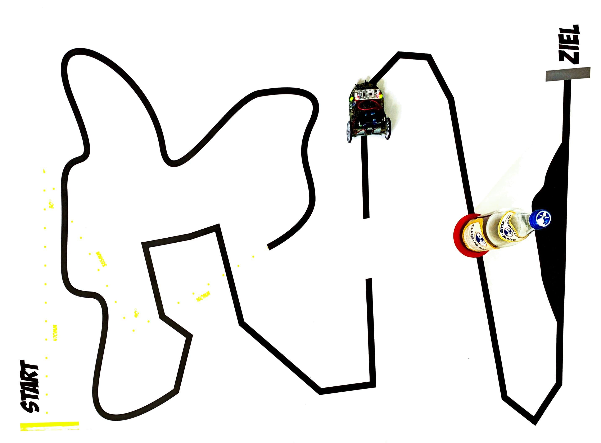

# MobileRobots

This code was created as part of the practical course Mobile Robots at KIT, in which, in addition to making this code, I built the robot myself and, above all, soldered the electronic components into the main board.

In the practical course, we dealt with basic circuit technology and the programming of microcontrollers in C and with the control of the sensors and actuators of the robot as well as with reflex-based autonomous behaviour generation. At the end of the practical course, the robot had to be able to master an obstacle course.

